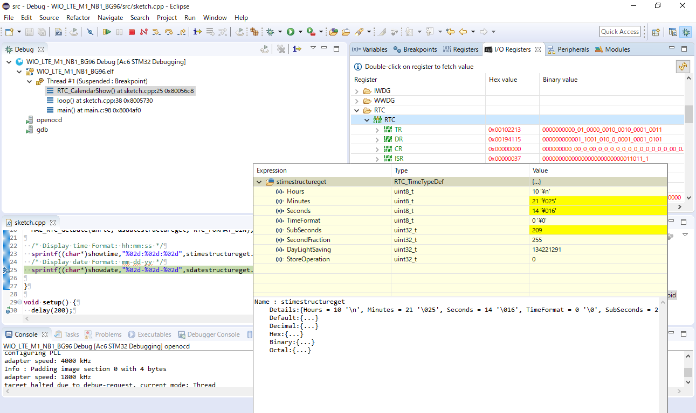

# Wio LTE M1/NB1(BG96) を  SW4STM32 で開発するためのプロジェクト雛形

debuggerの無いArduino IDEだと辛いから作った。

# 導入手順

1. System Workbench for STM32(SW4STM32) をダウンロードしてインストールする  [install_sw4stm32_win_64bits-v2.7.exe](http://www.ac6-tools.com/downloads/SW4STM32/install_sw4stm32_win_64bits-v2.7.exe)
1. 本プロジェクトをgit cloneする `git clone --recursive https://github.com/syncsyncsynchalt/WIO_LTE_M1_NB1_BG96.git`
1. SW4STM32を起動して、インポートする
1. build all
1. Wio LTE M1/NB1(BG96) をUSBで繋ぐ
1. debug

# サンプルコード

|  |  |
|---|---|
| Groveの3軸加速度センサの安い方 | Grove3AxisDigitalAccelerometer15.cpp |
| RTC | RTC.cpp |

